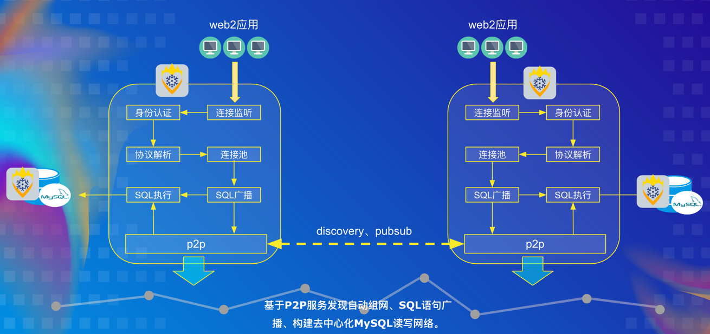

# IceFireDB-SQLProxy

IceFireDB去中心化SQL数据库代理，帮助传统SQL数据库数据去中心化。提供一套方便的机制构建全球分布式自动组网的存储系统。指令在组网的SQL 代理之间自动同步，IceFireDB SQL代理将数据写入MySQL存储。通过去中心化中间件网络代理，可以对于web2应用中常用的MySQL数据库进行去中心化数据同步的赋能。

## 它是如何工作的?
### 场景介绍

### 系统架构



## 入门

### 安装

```shell
git clone https://github.com/IceFireDB/IceFireDB-SQLProxy
cd IceFireDB-SQLProxy
make
```

### 快速开始

https://user-images.githubusercontent.com/21053373/173170210-df2d1539-acc1-4d93-8695-cc0ddc5d723b.mp4


### 用法

#### 配置文件
```yaml
server:
  addr: ":33306" # 代理监听的端口，支持mysql-client直连接

debug:  # 控制开启debug模式
  enable: true
  port: 17878

# 目标mysql实例配置
mysql:
  addr: "127.0.0.1:3306"
  user: "root"
  password: "root"
  dbname: "test"
  minAlive: 1 # 连接池将尝试维护的最小打开连接数
  maxAlive: 64 # 连接池将尝试维护的最大打开连接数
  maxIdle: 4 # 空闲连接最大数量

# mysql认证用户列表
userlist:
  - user: host1
    password: host1

# p2p config
p2p:
  enable: true
  # 自定义发现id, topic
  service_discovery_id: "p2p_sqlproxy_service_test"
  service_command_topic: "p2p_sqlproxy_service_topic_test"
  service_discover_mode: "advertise" # advertise or announce

```


#### 连接
支持任意语言通过标准mysql驱动连接使用，命令行mysql使用示例
```shell
$ mysql -h 127.0.0.1 -P 33306 -u host1 -phost1
Welcome to the MySQL monitor.  Commands end with ; or \g.
Your MySQL connection id is 10001
Server version: 5.7.0

Copyright (c) 2000, 2021, Oracle and/or its affiliates.

Oracle is a registered trademark of Oracle Corporation and/or its
affiliates. Other names may be trademarks of their respective
owners.

Type 'help;' or '\h' for help. Type '\c' to clear the current input statement.

mysql> show tables;
+----------------+
| Tables_in_test |
+----------------+
| people         |
+----------------+
1 row in set (0.01 sec)

mysql>
```


## License
IceFireDB SQLProxy使用Apache 2.0许可证。请参见 [LICENSE](./LICENSE) directory for details.

## 免责声明
当您使用本软件时，您已同意并声明本软件的作者、维护者和贡献者不对您遇到的任何风险、成本或问题负责。如果发现软件缺陷或BUG，请提交补丁以帮助改进！
