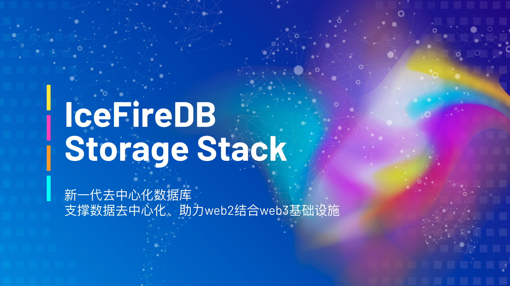
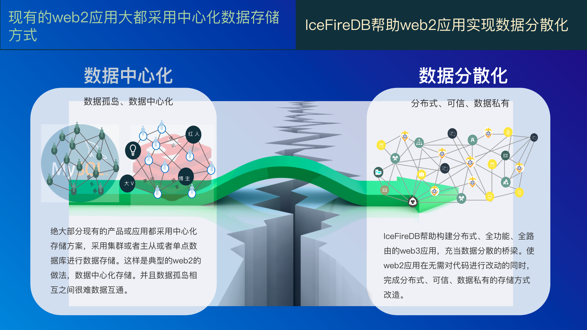

# 2022-Wanxiang-Blockchain-Spring-Hackathon-IceFireDB

# IceFireDB Storage Stack

IceFireDB 是为 web3 和 web2 构建的数据库。该项目的核心使命是帮助应用快速实现去中心化和数据不变性。目前存储层支持磁盘、OSS、IPFS等多种存储方式。协议层目前支持 RESP 、SQL协议，未来将支持 GraphQL 协议。IceFireDB努力填补去中心化栈的空白，让web3应用的数据生态更加完整，并使 web2 应用程序更容易实现去中心化和数据不变性。

IceFireDB 项目组成：

* IceFireDB-Decentralization-Pubsub
* IceFireDB-Decentralization-Redis-proxy
* IceFireDB-Decentralization-SQLite
* IceFireDB-Decentralization-SQLProxy

# 子项目介绍
## 一、IceFireDB-Decentralization-Pubsub
IceFireDB-Decentralization-Pubsub提供了方便的去中心化订阅命令。通过支持原生redis发布订阅协议及指令，使web2下使用redis发布订阅的应用可以无感的迁移到IceFireDB订阅系统中。

IceFireDB-Decentralization-Pubsub节点间通过P2P服务发现来发现节点自动组网，从而构建一个全球分布式web3发布订阅系统。

## 二、IceFireDB-Decentralization-Redis-proxy

IceFireDB-Decentralization-Redis-proxy数据库代理为传统redis数据库增加去中心化的翅膀。提供一套方便的机制构建全球分布式自动组网的存储系统。指令在组网的redis 代理之间自动同步，redis代理将数据写入集群或单点redis存储。

通过去中心化中间件网络代理，可以对于web2应用中常用的Redis数据库进行去中心化数据同步的赋能。

## 三、IceFireDB-Decentralization-SQLite

IceFireDB-Decentralization-SQLite数据库是一种去中心化SQLite数据库。提供一套方便的机制构建全球分布式数据库系统。支持用户以MySQL协议向IceFireDB-Decentralization-SQLite进行数据写入。IceFireDB-Decentralization-SQLite将数据存储到SQLite数据库，并将数据在P2P自动组网的节点间同步。

## 四、IceFireDB-Decentralization-SQLProxy

IceFireDB-Decentralization-SQLProxy是去中心化SQL数据库组网系统，帮助web2传统SQL数据库数据去中心化。提供一套方便的机制构建全球分布式自动组网的存储系统。指令在组网的IceFireDB-Decentralization-SQLProxy之间自动同步，各IceFireDB-Decentralization-SQLProxy将数据写入MySQL存储。

通过IceFireDB-Decentralization-SQLProxy去中心化组网，并提供web2程序对于SQL的读写支持，可以对于web2应用中常用的MySQL数据库读写场景进行去中心化数据同步的赋能。
