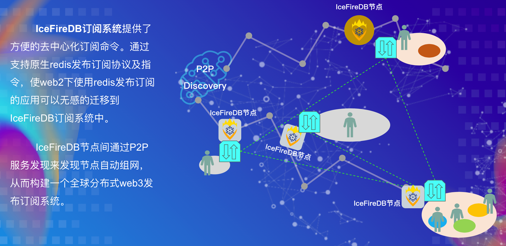
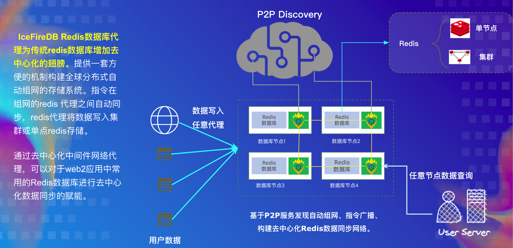
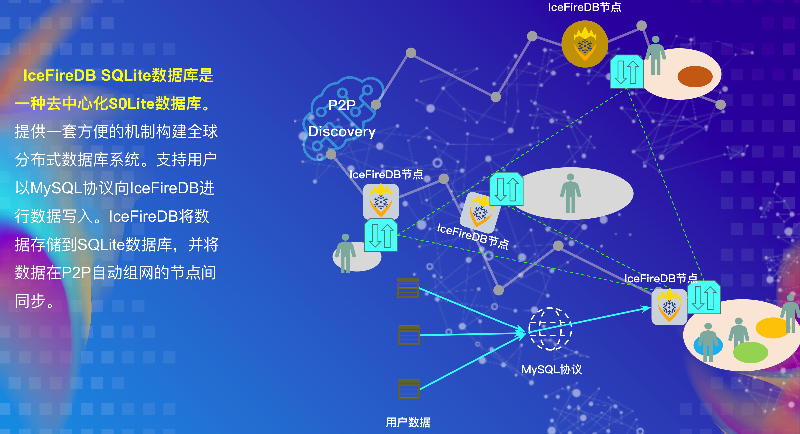
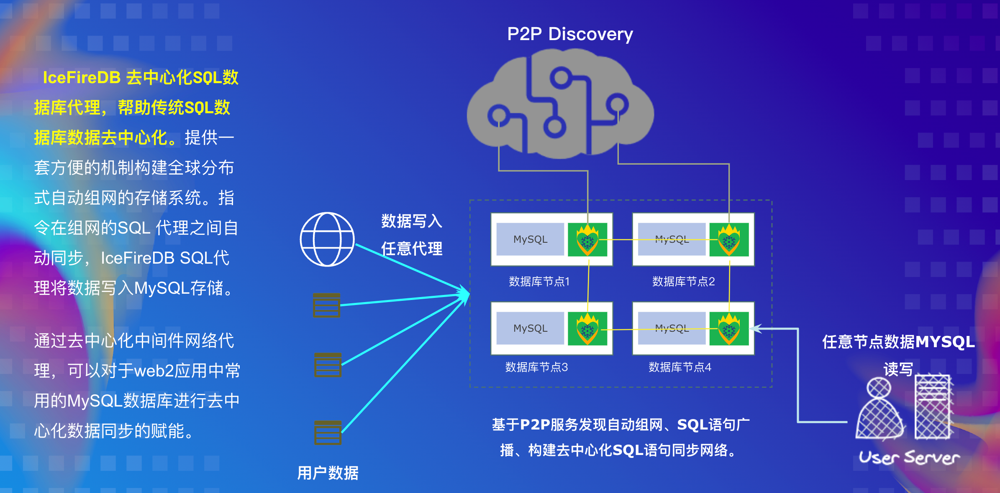
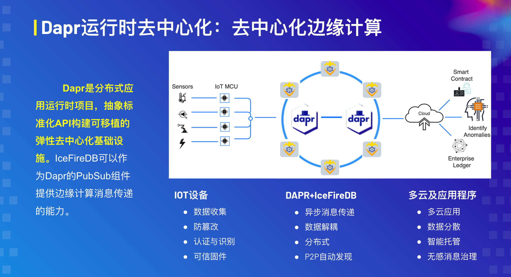
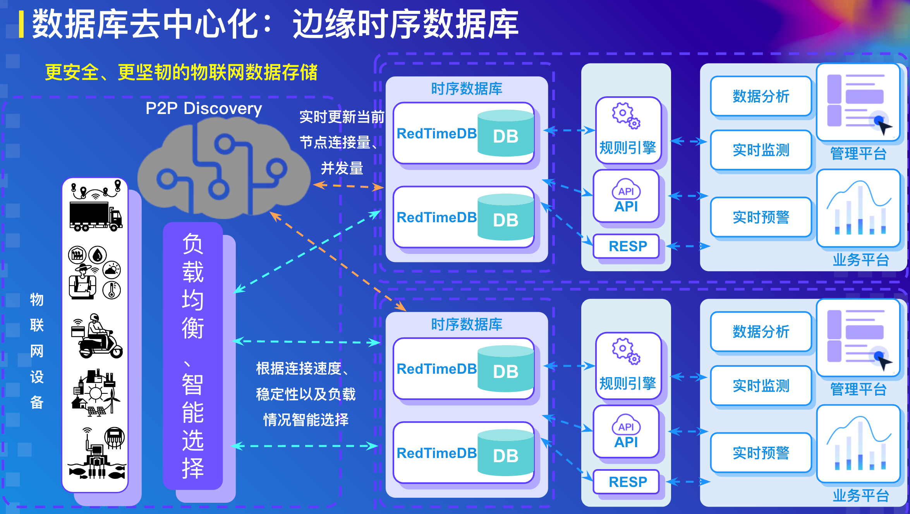

# 2022-Wanxiang-Blockchain-Spring-Hackathon-IceFireDB

[IceFireDB project address](https://github.com/IceFireDB/IceFireDB)

IceFireDB 是为 web3 和 web2 构建的数据库。该项目的核心使命是帮助应用快速实现去中心化和数据不变性。目前存储层支持磁盘、OSS、IPFS等多种存储方式。协议层目前支持 RESP 、SQL协议，未来将支持 GraphQL 协议。

IceFireDB努力填补去中心化栈的空白，让web3应用的数据生态更加完整，并使 web2 应用程序更容易实现去中心化和数据不变性。

IceFireDB 项目组成：

* [IceFireDB-Decentralization-Pubsub](https://github.com/wanxiang-blockchain/2022-Wanxiang-Blockchain-Spring-Hackathon-IceFireDB/tree/main/IceFireDB-Decentralization-Pubsub)
* [IceFireDB-Decentralization-Redis-proxy](https://github.com/wanxiang-blockchain/2022-Wanxiang-Blockchain-Spring-Hackathon-IceFireDB/tree/main/IceFireDB-Decentralization-Redis-proxy)
* [IceFireDB-Decentralization-SQLite](https://github.com/wanxiang-blockchain/2022-Wanxiang-Blockchain-Spring-Hackathon-IceFireDB/tree/main/IceFireDB-Decentralization-SQLite)
* [IceFireDB-Decentralization-SQLProxy](https://github.com/wanxiang-blockchain/2022-Wanxiang-Blockchain-Spring-Hackathon-IceFireDB/tree/main/IceFireDB-Decentralization-SQLProxy)

# 黑客马拉松-项目讲解

[项目讲解视频](https://res.cloudinary.com/malloc/video/upload/v1654959861/Hackathon_2022/%E9%A1%B9%E7%9B%AE%E8%AE%B2%E8%A7%A3_tappbv.mp4)

# 项目组成
## 一、[IceFireDB-Decentralization-Pubsub](https://github.com/wanxiang-blockchain/2022-Wanxiang-Blockchain-Spring-Hackathon-IceFireDB/tree/main/IceFireDB-Decentralization-Pubsub)
IceFireDB-Decentralization-Pubsub提供了方便的去中心化订阅命令。通过支持原生redis发布订阅协议及指令，使web2下使用redis发布订阅的应用可以无感的迁移到IceFireDB订阅系统中。

IceFireDB-Decentralization-Pubsub节点间通过P2P服务发现来发现节点自动组网，从而构建一个全球分布式web3发布订阅系统。

[演示视频](https://user-images.githubusercontent.com/52234994/173171008-8c73ce17-4ba7-42ec-8257-025e98d2e647.mp4)

## 二、[IceFireDB-Decentralization-Redis-proxy](https://github.com/wanxiang-blockchain/2022-Wanxiang-Blockchain-Spring-Hackathon-IceFireDB/tree/main/IceFireDB-Decentralization-Redis-proxy)

IceFireDB-Decentralization-Redis-proxy数据库代理为传统redis数据库增加去中心化的翅膀。提供一套方便的机制构建全球分布式自动组网的存储系统。指令在组网的redis 代理之间自动同步，redis代理将数据写入集群或单点redis存储。

通过去中心化中间件网络代理，可以对于web2应用中常用的Redis数据库进行去中心化数据同步的赋能。

[演示视频](https://user-images.githubusercontent.com/52234994/173170991-08713e52-291c-4fae-bf46-ce87b959ce90.mp4)

## 三、[IceFireDB-Decentralization-SQLite](https://github.com/wanxiang-blockchain/2022-Wanxiang-Blockchain-Spring-Hackathon-IceFireDB/tree/main/IceFireDB-Decentralization-SQLite)

IceFireDB-Decentralization-SQLite数据库是一种去中心化SQLite数据库。提供一套方便的机制构建全球分布式数据库系统。支持用户以MySQL协议向IceFireDB-Decentralization-SQLite进行数据写入。IceFireDB-Decentralization-SQLite将数据存储到SQLite数据库，并将数据在P2P自动组网的节点间同步。

[演示视频](https://user-images.githubusercontent.com/21053373/173170247-74b1daeb-7bd5-4dc0-8b93-62b334859ba8.mp4)

## 四、[IceFireDB-Decentralization-SQLProxy](https://github.com/wanxiang-blockchain/2022-Wanxiang-Blockchain-Spring-Hackathon-IceFireDB/tree/main/IceFireDB-Decentralization-SQLProxy)

IceFireDB-Decentralization-SQLProxy是去中心化SQL数据库组网系统，帮助web2传统SQL数据库数据去中心化。提供一套方便的机制构建全球分布式自动组网的存储系统。指令在组网的IceFireDB-Decentralization-SQLProxy之间自动同步，各IceFireDB-Decentralization-SQLProxy将数据写入MySQL存储。

通过IceFireDB-Decentralization-SQLProxy去中心化组网，并提供web2程序对于SQL的读写支持，可以对于web2应用中常用的MySQL数据库读写场景进行去中心化数据同步的赋能。

[演示视频](https://user-images.githubusercontent.com/21053373/173170210-df2d1539-acc1-4d93-8695-cc0ddc5d723b.mp4)

# 应用场景 - 云原生结构下的新模式

## 一、去中心化边缘计算

## 二、去中心化边缘数据存储

## 三、去中心化边缘时序数据库

# 团队

# 免责声明

当您使用本软件时，您已同意并声明本软件的作者、维护者和贡献者不对您遇到的任何风险、费用或问题负责。如果发现软件缺陷或BUG，请提交补丁帮助改进！
